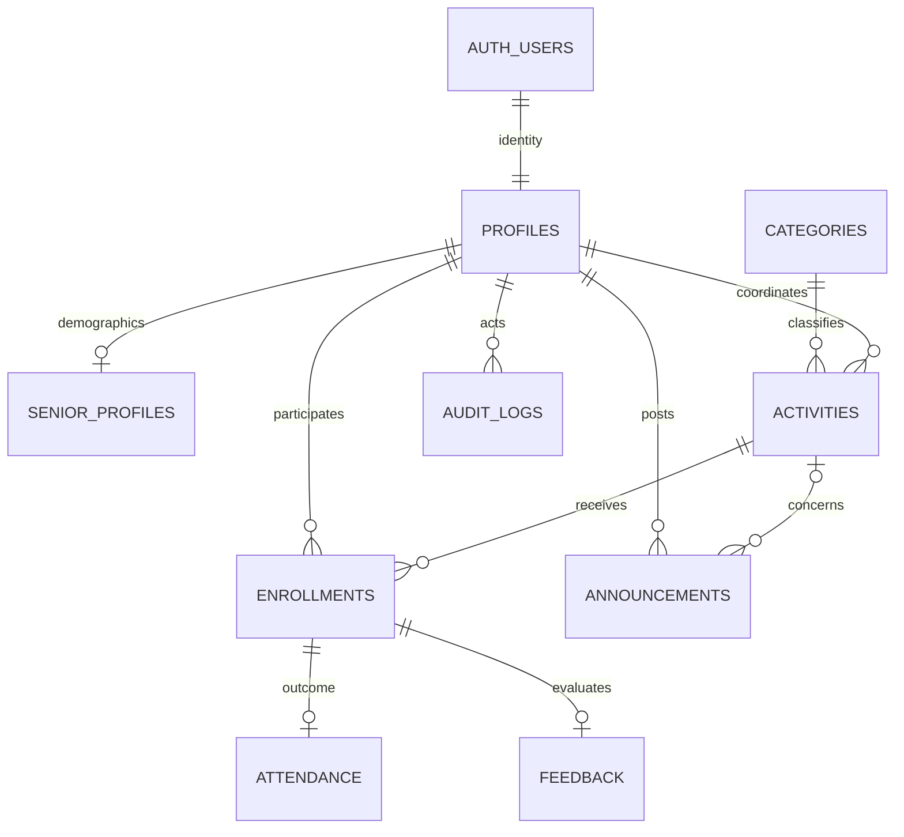

# Relational model

The Auth UUID is profiles.user_id. No application password or password-hash column exists. Contact email remains in Supabase Auth. Senior demographics are optional; identity documents are not collected.

Enrollment status is pending/confirmed/waitlisted/cancelled/completed. A partial unique index permits only one non-cancelled enrollment per activity and senior, while preserving past cancellations. The waitlist is ordered by enrolled_at then enrollment_id rather than a stored position that becomes stale. Activity row locks serialize enrollment/withdrawal/staff seat operations.

Activities require positive capacity, end after start, and cutoff no later than start. Attendance and feedback have unique enrollment references. Feedback ratings are 1–5. Foreign keys preserve actor, coordinator, category and participant references. Application deletion is cancel/archive, preserving history.

settings is a one-row deployment policy table controlling optional verification. It is readable to active users and writable only through trusted database administration.

Apply migrations once in filename order. The database test harness applies every migration to an isolated PostgreSQL instance and validates representative authorization/business rules.
