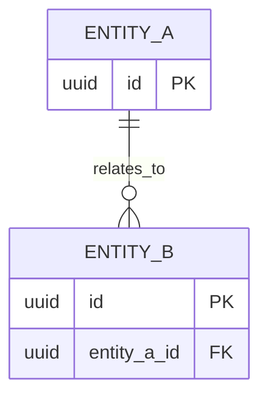

# Database ERD

Do not finalize the SQL schema until this document matches the approved
Phase 1 requirements.

## Entity Checklist

For every entity identify:

- purpose
- primary key
- attributes
- required vs nullable fields
- unique constraints
- foreign keys
- delete/update behavior
- indexes needed by actual queries

## Proposed Entities

| Entity | Purpose | Related requirements |
| --- | --- | --- |
| TBD | TBD | TBD |

## Relationships

| Parent | Child | Cardinality | Foreign key |
| --- | --- | --- | --- |
| TBD | TBD | TBD | TBD |

## Mermaid ERD Template

Replace the placeholder after the entities are approved.

Remove `ENTITY_A` and `ENTITY_B`. They are documentation placeholders only and
must not be copied into `supabase/schema.sql`.
