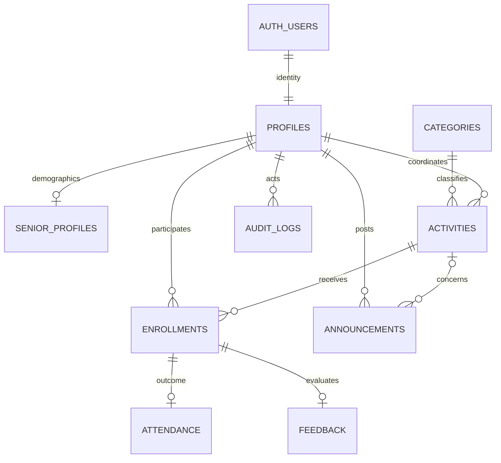

# Relational model

```mermaid
erDiagram
    AUTH_USERS ||--|| PROFILES : identity
    PROFILES ||--o| SENIOR_PROFILES : demographics
    PROFILES ||--o{ ACTIVITIES : coordinates
    CATEGORIES ||--o{ ACTIVITIES : classifies
    ACTIVITIES ||--o{ ENROLLMENTS : receives
    PROFILES ||--o{ ENROLLMENTS : participates
    ENROLLMENTS ||--o| ATTENDANCE : outcome
    ENROLLMENTS ||--o| FEEDBACK : evaluates
    ACTIVITIES o|--o{ ANNOUNCEMENTS : concerns
    PROFILES ||--o{ ANNOUNCEMENTS : posts
    PROFILES ||--o{ AUDIT_LOGS : acts
```

The Auth UUID is profiles.user_id. No application password or password-hash column exists. Contact email remains in Supabase Auth. Senior demographics are optional; identity documents are not collected.

Enrollment status is pending/confirmed/waitlisted/cancelled/completed. A partial unique index permits only one non-cancelled enrollment per activity and senior, while preserving past cancellations. The waitlist is ordered by enrolled_at then enrollment_id rather than a stored position that becomes stale. Activity row locks serialize enrollment/withdrawal/staff seat operations.

Activities require positive capacity, end after start, and cutoff no later than start. Attendance and feedback have unique enrollment references. Feedback ratings are 1–5. Foreign keys preserve actor, coordinator, category and participant references. Application deletion is cancel/archive, preserving history.

settings is a one-row deployment policy table controlling optional verification. It is readable to active users and writable only through trusted database administration.

Apply migrations once in filename order. The database test harness applies every migration to an isolated PostgreSQL instance and validates representative authorization/business rules.

## Current implementation details

- `activities` stores the activity lifecycle plus `is_free`, `fee`, and optional image/image URL attributes. These are attributes of an activity, not separate entities.
- `enrollments.payment_status` records whether an activity needs no payment, is unpaid, or has been paid onsite in cash. KomuniEdad does not collect card or bank details and therefore does not model an online payment account.
- Onsite cash changes are written to `audit_logs` with the actor, activity/enrollment target, amount, status, and reason. Attendance for a paid activity is blocked until the enrollment is marked paid.
- Activity cancellation/archive is used instead of destructive deletion so enrollment, attendance, feedback, announcements, and audit history remain referentially intact.
- Optional profile/activity images do not change the relational ownership model shown above.
